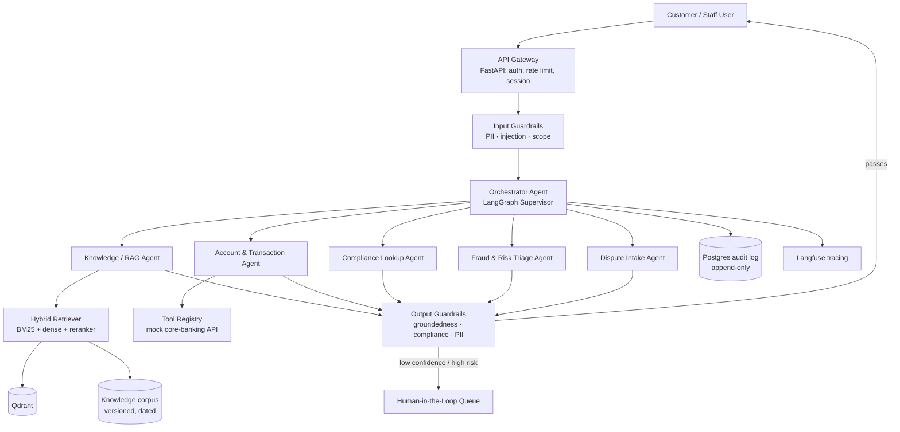

# FinSight — Architecture v1.0

Production-oriented reference design · 100% free/open-source stack

**Scope:** Customer-facing assistant + internal staff co-pilot, unified under one agent platform.

---

## 1. What this system does

### Customer-facing agents

| Agent | Job |
|-------|-----|
| Knowledge Agent | Product/policy/fee questions grounded in T&Cs, rate sheets, FAQs — with citations |
| Account Agent | Balance, transaction history, card status, statement lookups (mock core-banking API) |
| Dispute Intake Agent | Interviews customer, drafts dispute ticket; human always approves before filing |
| Eligibility Pre-Check Agent | Informational-only loan/card estimate — **never** a credit decision |

### Internal (staff-facing) agents

| Agent | Job |
|-------|-----|
| Compliance Lookup Agent | AML/KYC/SOP questions from internal corpus, with citations and effective dates |
| Fraud/Risk Triage Agent | Summarizes flagged alerts, surfaces risk indicators, ranks by severity |
| Regulatory Search Agent | Grounded excerpts from paraphrased circulars/regulations (never full-text reproduction) |
| Service Co-Pilot | Suggests grounded responses for a live agent; agent stays in control |

**Cross-cutting:** none of these agents may say something the retrieved evidence doesn't support, and none may do anything irreversible without a human confirming.

---

## 2. High-level architecture



**Flow:** request → gateway → PII-scrub + scope-check → orchestrator routes to specialist(s) → retrieve / tool-call → output guardrail → user **or** HITL. Every step audited.

---

## 3. Why this is “not a POC”

| Concern | How FinSight treats it |
|---------|------------------------|
| Retrieval | Hybrid + reranked — not naive top-k cosine |
| Grounding | Cite chunk IDs; verify entailment before shipping |
| Abstention | First-class correct output when confidence is low |
| Irreversible actions | Prepare/recommend only; human confirms |
| Accuracy | Golden set + CI gate on every PR |
| Audit | Append-only log of query, chunks, tools, answer |
| Knowledge | Versioned + dated; superseded docs filtered |

---

## 4. Accuracy & anti-hallucination pipeline

```
User query
   │
   ▼
Query context (history-aware message)
   │
   ▼
Hybrid retrieval: BM25(20) + dense(20) → RRF merge → rerank → top 5
   │
   ▼
Confidence gate (reranker score ≥ threshold?)
   ├── No  → abstain + offer handoff
   └── Yes → generate with forced [chunk_id] citations
                │
                ▼
           Groundedness verifier
                ├── Fail → regenerate once, else abstain
                └── Pass → compliance guardrail → user + audit
```

---

## 5. Tech stack

See README. Entirely free/open-source; `LLM_PROVIDER` switches Ollama / Groq / Together / mock.

---

## 6. Data strategy

- Synthetic product documents (T&Cs, rate sheets, FAQs)
- Paraphrased public regulatory guidance — never long-form reproduction
- Synthetic customers via `data/synthetic_customers.py` — **no real PII, ever**
- Metadata on every chunk: `doc_type`, `effective_date`, `access_role`, `source`, optional `superseded_by`
- Customer agents cannot retrieve `access_role: staff` documents

---

## 7. Evaluation strategy

- Golden set: `data/golden_eval_set.jsonl` (160+ QA pairs + adversarial refusals)
- Metrics: faithfulness / context precision·recall / answer relevancy (RAGAS when available; offline keyword+citation proxies in CI/mock mode)
- Gate: `eval/thresholds.yaml`
- Adversarial set scored pass/fail on refusal
- Load: Locust (`eval/load_test.py`)

---

## 8. Build phases (shipped in this repo)

| Phase | Deliverable | Status |
|-------|-------------|--------|
| 1 | Corpus + ingest + hybrid retriever + Knowledge Agent + groundedness | ✅ |
| 2 | LangGraph orchestrator + Account Agent + mock banking API | ✅ |
| 3 | Input/output guardrails + Compliance Agent + PII | ✅ |
| 4 | Fraud/Risk + Dispute + HITL queue | ✅ |
| 5 | Golden eval + CI gate + Langfuse hook + Locust + Docker + README | ✅ |

---

## 9. Honest caveats

- Production-**shaped**, not wired to a real bank core.
- Free-tier LLM rate limits apply; local Ollama for offline.
- Full bge models need resources; `LIGHTWEIGHT_MODE=true` is the default demo/CI path.
